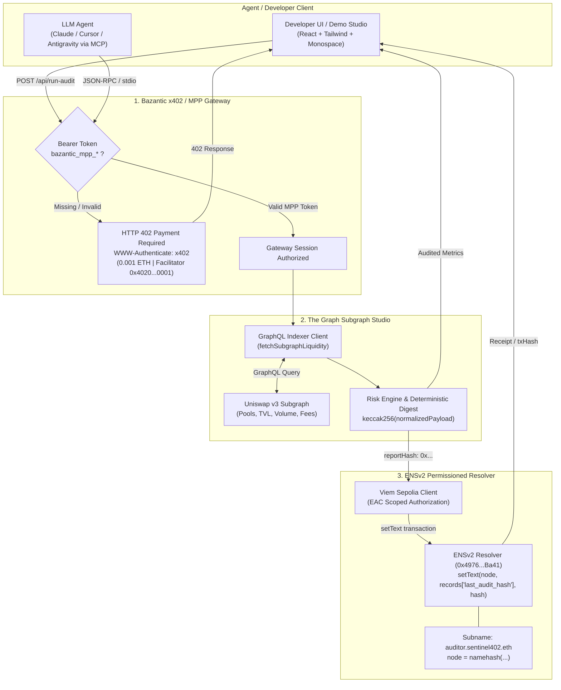

# Sentinel402 Gateway

Autonomous on-chain liquidity auditor powered by x402 Micropayments, The Graph indexing, and ENSv2 permissioned attestation.

---

## Overview

Autonomous AI agents executing financial analysis and API operations require two missing primitives:
1. **Machine-native payment rails:** Trustless pay-per-request monetization without API keys or accounts.
2. **Verifiable proof of execution:** Tamper-proof, on-chain records proving that an audit was performed against canonical state.

**Sentinel402 Gateway** addresses both. It sits in front of a decentralized liquidity auditing pipeline as an RFC-compliant **x402 Micropayment Protocol (MPP)** gateway. When an autonomous agent requests an audit:
- The gateway challenges unauthenticated callers with an `HTTP 402 Payment Required` response containing micropayment parameters.
- Upon receiving valid payment, it queries **The Graph Subgraph Studio** for live Uniswap v3 mainnet liquidity metrics, calculates depth scores and slippage risk, and computes a canonical `keccak256` report hash.
- It commits this audit digest directly to Ethereum Sepolia using an **ENSv2 Permissioned Resolver** under the subname `auditor.sentinel402.eth`.
- All operations are also exposed via a native **Model Context Protocol (MCP)** server for LLM tools (Claude, Cursor, Antigravity).

---

## Architecture



---

## Core Capabilities

### 1. x402 Micropayment Protocol Gateway
- Intercepts requests to `POST /api/run-audit`.
- Responds to unauthenticated requests with an RFC-compliant `HTTP 402 Payment Required` challenge specifying price (`0.001 ETH`), scheme (`x402`), and facilitator address (`0x4020000000000000000000000000000000000001`).
- Implements a declarative 3-step pipeline via [`bazantic/recipe.json`](./bazantic/recipe.json).

### 2. Live Subgraph Indexing & Deterministic Audit Engine
- Queries The Graph Subgraph Studio for live Uniswap v3 pool states (`totalValueLockedUSD`, `volumeUSD`, `feeTier`, `liquidity`).
- Calculates liquidity velocity ratios, depth scores, and slippage risk tiers.
- Produces a canonical `keccak256` payload hash (`reportHash`) representing the verified protocol snapshot.

### 3. ENSv2 Permissioned Resolver Attestation
- Connects to Ethereum Sepolia via Viem.
- Resolves the subname `auditor.sentinel402.eth` using `namehash`.
- Invokes `setText(bytes32 node, string key, string value)` on the ENSv2 Permissioned Resolver (`0x4976fb03C32e5B8cfe2b6cCB31c09Ba78EBaBa41`) with EAC key `records['last_audit_hash']`.
- Supports live Sepolia on-chain broadcast as well as deterministic simulation for automated CI/CD verification.

### 4. Model Context Protocol (MCP) Server
- Exposes tools over stdio and HTTP (`POST /api/mcp`):
  - `audit_pool_liquidity`: Triggers audit pipeline and returns scored metrics + attestation digest.
  - `get_ens_attestation`: Reads verified audit hash from ENSv2 resolver for any subname.
  - `get_bazantic_challenge`: Inspects x402 payment specifications and facilitator parameters.

---

## Quickstart

### Prerequisites
- Node.js v18+ or v20+ (managed via mise or nvm)
- npm or pnpm

### 1. Installation
```bash
npm install
npm install --prefix client
```

### 2. Configuration
```bash
cp .env.example .env
```
Default parameters in `.env`:
- `PORT=8080`
- `THE_GRAPH_SUBGRAPH_URL=https://api.thegraph.com/subgraphs/name/uniswap/uniswap-v3`
- `SEPOLIA_RPC_URL=https://ethereum-sepolia-rpc.publicnode.com`
- `ENS_AGENT_SUBNAME=auditor.sentinel402.eth`
- `X402_FACILITATOR_ADDRESS=0x4020000000000000000000000000000000000001`

### 3. Run Locally
```bash
# Starts Express gateway (port 8080) and Vite frontend (port 5173)
npm run dev
```
- Web UI: `http://localhost:5173`
- Gateway API: `http://localhost:8080`

### 4. Run AI Agent MCP Server
```bash
npm run mcp
```

### 5. CLI Automated Flow & Recording
```bash
# Execute end-to-end audit lifecycle and record run JSON + asciinema cast
npm run record

# Replay the recorded CLI cast
npm run play
```

### 6. Testnet Keypair Generation (Optional)
```bash
npm run generate-wallet
```

---

## Targeted Hackathon Tracks

| Track | Category | Integration Summary |
|---|---|---|
| **Bazantic** | Best Recipe using Sponsor APIs | Implements the x402/MPP HTTP 402 paywall gateway and declarative 3-step recipe ([`bazantic/recipe.json`](./bazantic/recipe.json)) governing authentication, indexing, and on-chain settlement. |
| **The Graph** | Best AI Tooling / AI Use Case (From Scratch) | Uses Subgraph Studio GraphQL to index live Uniswap v3 pool data for automated risk scoring, paired with a full Model Context Protocol (MCP) server for autonomous LLM agent execution. |
| **ENS** | Best Use of ENSv2 | Integrates next-gen ENSv2 Permissioned Resolvers (`0x4976...Ba41`) on Sepolia, publishing EAC-scoped `records['last_audit_hash']` attestations under `auditor.sentinel402.eth`. |

---

## API & Endpoints

| Method | Endpoint | Description | Auth |
|---|---|---|---|
| `GET` | `/api/health` | Gateway status, agent subname, wallet, and network details | None |
| `POST` | `/api/run-audit` | Executes liquidity audit and writes ENSv2 attestation | `Bearer bazantic_mpp_*` (triggers 402 if missing) |
| `GET` | `/api/recipe` | Returns the declarative Bazantic recipe schema | None |
| `GET` | `/api/agent-profile` | Identity, resolver address, and ENS text records | None |
| `POST` | `/api/mcp` | MCP JSON-RPC protocol endpoint for AI agent tools | None / x402 |

---

## Repository Structure

```
.
├── bazantic/
│   ├── recipe.json                 # Declarative Bazantic Recipe definition
│   └── README.md                   # Recipe lifecycle documentation
├── client/
│   ├── src/
│   │   ├── components/
│   │   │   ├── AuditSummary.jsx    # Metrics and attestation hash cards
│   │   │   ├── ChallengeModal.jsx  # HTTP 402 challenge & recipe modal
│   │   │   ├── DemoStudio.jsx      # Interactive 4-stage walkthrough & recorder
│   │   │   ├── EacInspector.jsx    # ENSv2 resolver record inspector
│   │   │   ├── HeaderBadge.jsx     # Identity bar, network status & segmented theme
│   │   │   ├── NetworkStatusCard.jsx # Live Sepolia & Subgraph node status
│   │   │   ├── PoolsTable.jsx      # Subgraph audited liquidity table
│   │   │   └── TerminalLog.jsx     # Monospace lifecycle console
│   │   ├── App.jsx                 # Client state coordinator
│   │   ├── index.css               # Monochrome styling & scrollbars
│   │   └── main.jsx
│   ├── index.html
│   └── tailwind.config.js
├── recordings/                     # Generated CLI demo casts and audit run JSONs
├── scripts/
│   ├── mcp_server.js               # Model Context Protocol stdio server
│   ├── record_flow.js              # Automated end-to-end CLI runner
│   └── generate_wallet.js          # Sepolia keypair generator
├── server/
│   ├── contracts/
│   │   └── ENSv2PermissionedResolver.json # ABI & Sepolia contract metadata
│   ├── src/
│   │   ├── ens.js                  # ENSv2 viem client & setText attestation
│   │   └── graph.js                # Subgraph Studio GraphQL client & audit hash
│   └── index.js                    # Express gateway & x402 middleware
└── package.json
```

---

## License

MIT
