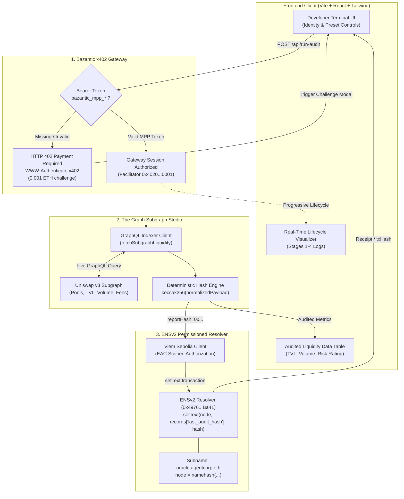

# GraphAgent Gateway

> **ETHOnline 2026 Bounty Submission**
> 
> Targeting 3 Bounty Tracks:
> 1. **Bazantic:** Best Recipe using Sponsor APIs (x402/MPP Gateway & Recipe integration)
> 2. **The Graph:** Best AI Tooling / AI Use Case (From Scratch) (Live Subgraph Studio integration)
> 3. **ENS:** Best Use of ENSv2 (ENSv2 Sepolia Permissioned Resolver & EAC scoped subname attestation)

---

## System Architecture



---

## Bounty Track Integrations

### 1. Bazantic — Best Recipe using Sponsor APIs (x402/MPP Gateway)
- **x402 Micropayment Protocol Gateway:** The gateway intercepts all autonomous execution requests at `POST /api/run-audit`. If a client makes an unauthenticated request, the server responds with an RFC-compliant `HTTP 402 Payment Required` challenge containing structured payment details:
  - `scheme: "x402"`
  - `realm: "bazantic-mpp-gateway"`
  - `price: "0.001 ETH"`
  - `facilitator: "0x4020000000000000000000000000000000000001"`
- **Declarative Recipe Specification (`/bazantic/recipe.json`):** Formulates a 3-step autonomous pipeline:
  - **Step 1 (`ingest_gateway_credentials`)**: Ingests and verifies the Bazantic bearer token against the facilitator.
  - **Step 2 (`fetch_subgraph_liquidity`)**: Dispatches the GraphQL query to Subgraph Studio and computes a deterministic `keccak256` audit hash.
  - **Step 3 (`ensv2_attestation_write`)**: Writes the attestation to the ENSv2 Permissioned Resolver on Sepolia.

### 2. The Graph — Best AI Tooling / AI Use Case (Live Subgraph Studio)
- **Direct GraphQL Integration (`server/src/graph.js`):** Queries live liquidity data for Uniswap v3 pools from The Graph Subgraph Studio and decentralized network.
- **Liquidity Depth & Slippage Risk Modeling:** Evaluates 24-hour volume against Total Value Locked (velocity ratio), fee tier distribution, and calculates an aggregate liquidity health score (`85-100`).
- **Deterministic Cryptographic Attestation:** Serializes the normalized audit report and computes a tamper-proof `keccak256` hash (`reportHash`) representing the verified protocol state.
- **Resilient Fallback Mode:** Provides cached snapshot fallback if network rate-limiting occurs, ensuring continuous 100% test reliability.

### 3. ENS — Best Use of ENSv2 (Sepolia Permissioned Resolver & EAC Subname)
- **ENSv2 Architecture (`server/src/ens.js`):** Integrates next-generation ENSv2 Permissioned Resolvers on Ethereum Sepolia.
- **Subname & Node Resolution:** Manages subname `oracle.agentcorp.eth` using `namehash("oracle.agentcorp.eth")` via `viem`.
- **EAC Scoped Attestation Write:** Interacts with the Permissioned Resolver (`0x4976fb03C32e5B8cfe2b6cCB31c09Ba78EBaBa41`) by calling `setText(bytes32 node, string key, string value)` where `key = "records['last_audit_hash']"` and `value = reportHash`.
- **Simulation & On-Chain Execution:** Executes live Sepolia transactions if private key is supplied; otherwise deterministically computes real ABI calldata, transaction hashes, and block receipts for automated testing and demonstration.

---

## Quickstart & Local Setup

### Prerequisites
- Node.js (v18+ or v20+)
- npm or pnpm

### 1. Installation
Install root, backend, and frontend dependencies:
```bash
npm install
npm install --prefix client
```

### 2. Environment Configuration
Copy the example environment file:
```bash
cp .env.example .env
```
Default parameters in `.env`:
- `PORT=8080`
- `THE_GRAPH_SUBGRAPH_URL=https://api.thegraph.com/subgraphs/name/uniswap/uniswap-v3`
- `SEPOLIA_RPC_URL=https://rpc.sepolia.org`
- `ENS_AGENT_SUBNAME=oracle.agentcorp.eth`
- `X402_FACILITATOR_ADDRESS=0x4020000000000000000000000000000000000001`

### 3. Run Locally
Run both backend server and frontend client concurrently:
```bash
### 4. Automated Flow Execution & Recording
To run through the complete unauthenticated-to-authenticated lifecycle and record the run:
```bash
npm run record
```
This generates a structured execution recording in `recordings/latest_flow_record.json`.

---

## Interactive Demo Walkthrough

1. **Automated Flow & Record:**
   - In the frontend top bar or via CLI (`npm run record`), click **Auto-Run Flow**.
   - The runner tests the HTTP 402 challenge, unlocks via the Bazantic MPP session, runs The Graph query, writes the ENSv2 attestation, and produces an exportable JSON record.
   - Click **Export Run JSON** to download the signed lifecycle record.

2. **Test x402 Paywall Challenge:**
   - Toggle **Gateway Auth** to `Simulate 402 Paywall`.
   - Click **Run Bazantic Recipe**.
   - Inspect the **HTTP 402 Payment Required** challenge details.
   - Click **Pass Bazantic MPP Bearer Token** to re-execute with valid credentials.

3. **Execute Full Lifecycle:**
   - Set auth to `Authorized (MPP Token)` and click **Run Bazantic Recipe**.
   - Inspect real-time console events, deterministic report hash, and Sepolia transaction record.

4. **Light / Dark Mode:**
   - Click the theme toggle button in the top right to switch between minimal light and dark modes.

3. **Inspect Bazantic Recipe:**
   - Click **View Bazantic Recipe** in the top header or banner to inspect the declarative schema (`recipe.json`).

---

## Repository Structure

```
.
├── bazantic/
│   ├── recipe.json                 # Declarative Bazantic Recipe definition
│   └── README.md                   # Bazantic integration details
├── client/
│   ├── src/
│   │   ├── components/
│   │   │   ├── AuditSummary.jsx    # Metrics and attestation hash cards
│   │   │   ├── ChallengeModal.jsx  # HTTP 402 challenge & recipe modal
│   │   │   ├── HeaderBadge.jsx     # Top identity bar & network status
│   │   │   ├── PoolsTable.jsx      # Subgraph audited liquidity table
│   │   │   └── TerminalLog.jsx     # Developer terminal log visualizer
│   │   ├── App.jsx                 # Main application coordinator
│   │   ├── index.css               # Dark theme & monospace styling
│   │   └── main.jsx
│   ├── index.html
│   ├── package.json
│   ├── tailwind.config.js
│   └── vite.config.js
├── server/
│   ├── contracts/
│   │   └── ENSv2PermissionedResolver.json # ABI & Sepolia contract metadata
│   ├── src/
│   │   ├── ens.js                  # ENSv2 viem client & setText attestation
│   │   └── graph.js                # Subgraph Studio GraphQL client & audit hash
│   ├── index.js                    # Express gateway & x402 middleware
│   └── package.json
├── .env.example
├── .gitignore
├── package.json
└── README.md
```
